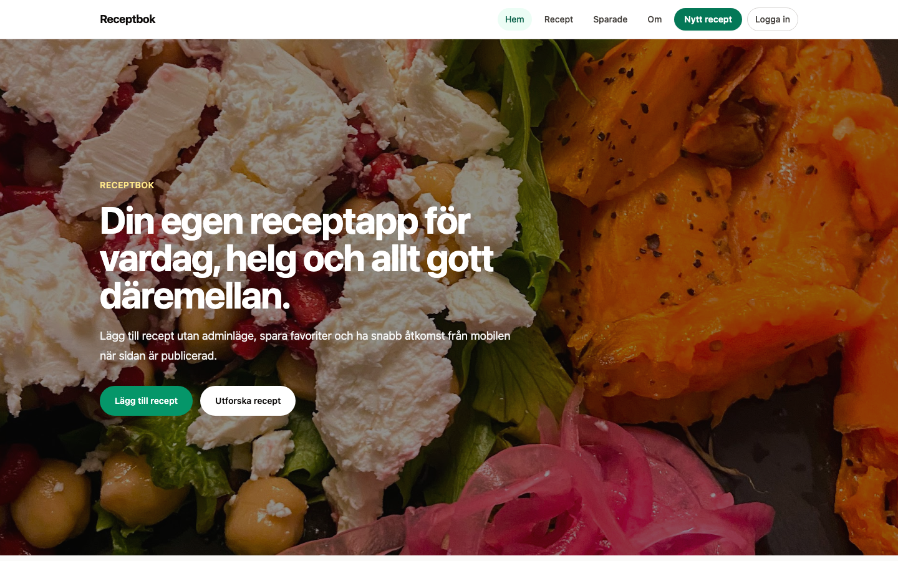
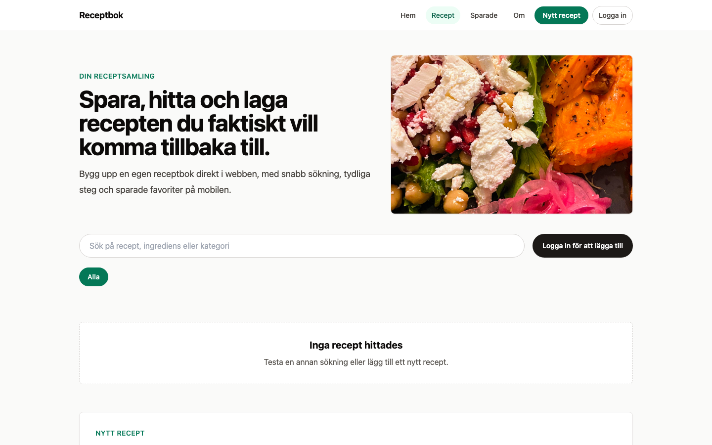
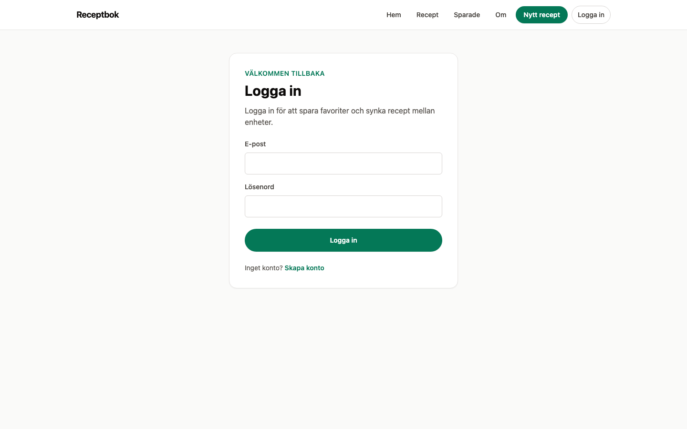
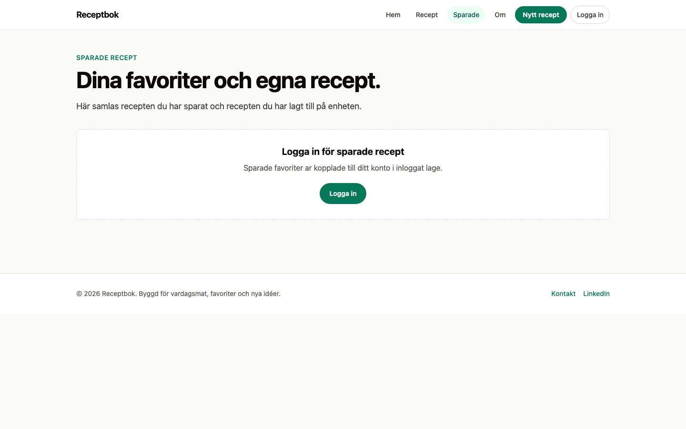
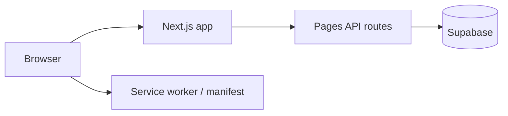

# Recipe Book Platform


Full-stack recipe collection app: browse and search recipes, save favorites, and manage your personal cookbook. Built with Next.js, Supabase, and a PWA-ready frontend (Swedish UI).

**Live demo:** [recipe-book-platform.netlify.app](https://recipe-book-platform.netlify.app)

## Highlights

- **Recipe library** with search, categories, and detail pages
- **Authentication** via Supabase (register, login, email callback)
- **Favorites** synced for logged-in users
- **Hybrid routing** — App Router home + Pages Router for library and API routes
- **PWA support** — manifest, service worker, mobile-friendly layout
- **CI** — GitHub Actions lint and build on every push

## Screenshots

| Home | Recipe library | Recipe detail |
|------|----------------|---------------|
|  |  |  |

| Login | Saved recipes |
|-------|----------------|
|  |  |

## Tech stack

| Layer | Choice |
|-------|--------|
| Frontend | Next.js 16, React 19, TypeScript, Tailwind CSS |
| Backend | Next.js Pages API routes |
| Database / Auth | Supabase (PostgreSQL + Auth) |
| Deploy | Netlify (`@netlify/plugin-nextjs`) |
| Legacy | Express/Mongo backend in `backend/` (deprecated, not used in production) |

## Architecture



## Local development

```bash
git clone https://github.com/Elli2022/recipe-book-platform.git
cd recipe-book-platform/frontend
cp .env.example .env.local
npm install
npm run dev
```

Open http://localhost:3000

### Environment variables

| Variable | Required | Description |
|----------|----------|-------------|
| `NEXT_PUBLIC_SUPABASE_URL` | Yes | Supabase project URL |
| `NEXT_PUBLIC_SUPABASE_ANON_KEY` | Yes | Public anon key |
| `SUPABASE_SERVICE_ROLE_KEY` | Yes (API routes) | Server-side admin key — never expose to client |

See `supabase/README.md` for schema migrations and auth redirect setup.

### Scripts

```bash
npm run dev      # local development
npm run build    # production build
npm run lint     # ESLint
npm run screenshots  # capture README screenshots (Playwright)
```

## Project structure

```text
frontend/          # Next.js application (active)
  src/app/         # App Router (home, shared components)
  src/pages/       # Pages Router (library, auth, API)
  src/lib/         # Supabase client, recipe helpers
supabase/          # SQL migrations and docs
backend/           # Deprecated Express/Mongo prototype
```

## For reviewers / interviews

1. **Full-stack scope:** Auth, CRUD recipes, favorites, and deployable production config — not just a static recipe list.
2. **Pragmatic migration:** App Router for marketing home while library/API remain on Pages Router during incremental migration.
3. **Offline-friendly touches:** Local recipe cache + PWA for mobile use cases.
4. **Tradeoff:** Deprecated Mongo backend kept for history; production path is Supabase-only.

## License

ISC
